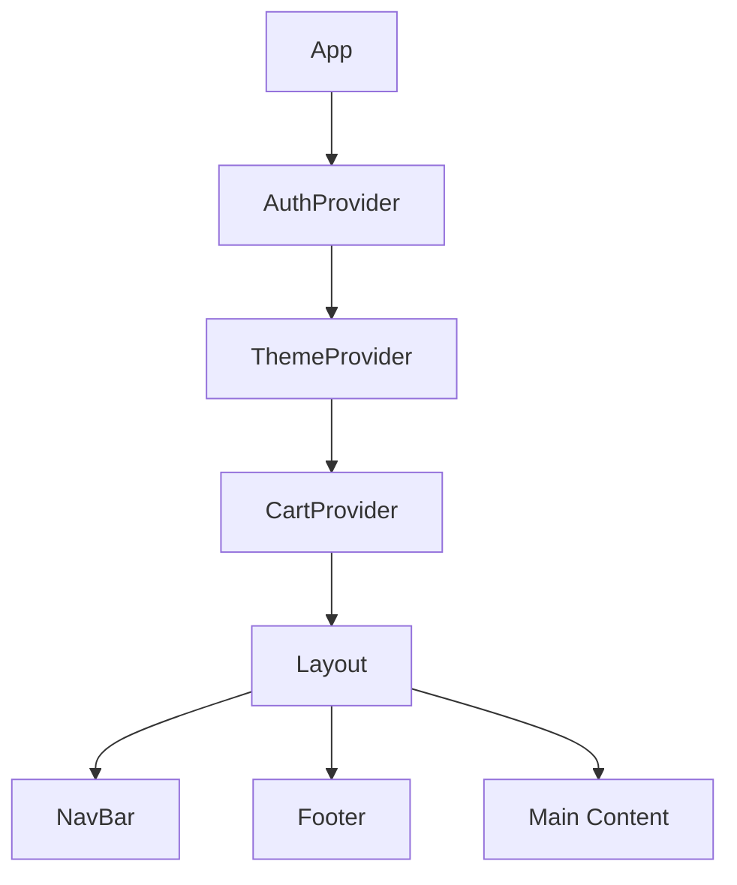
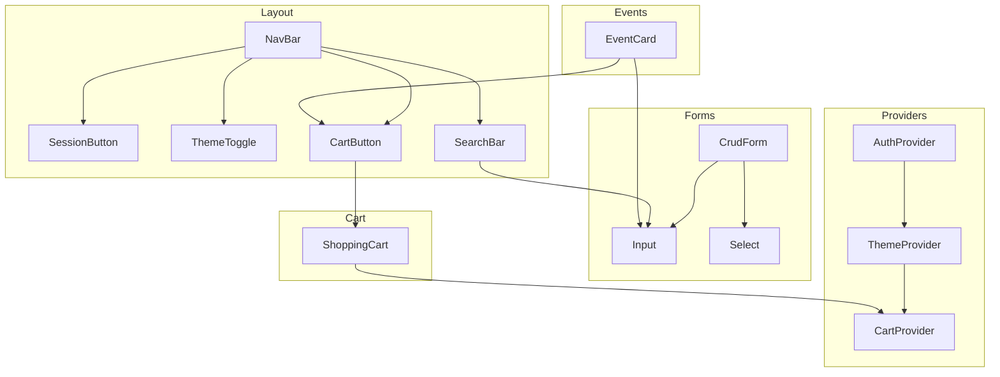
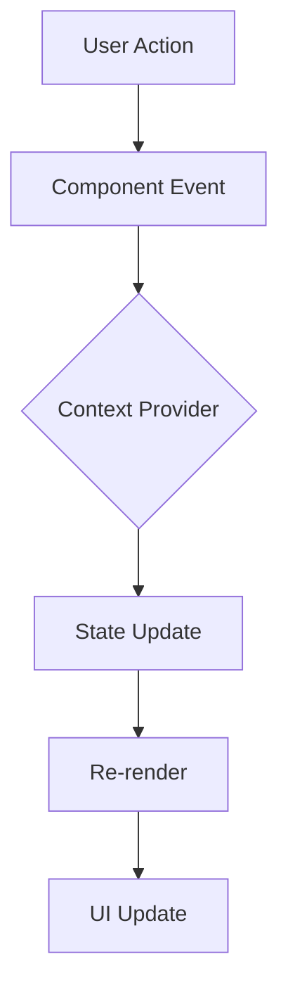
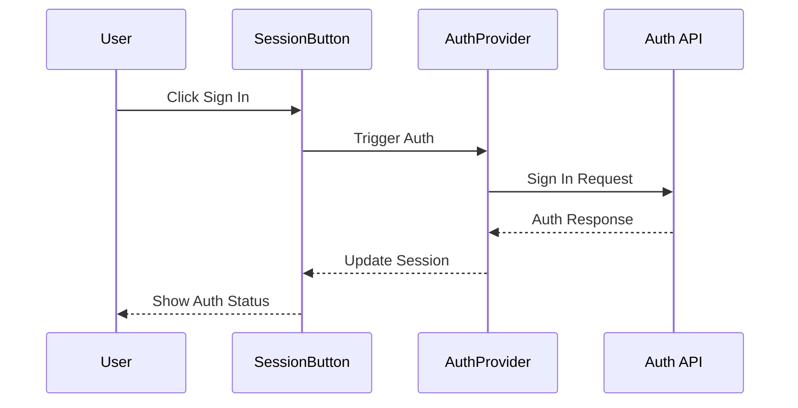
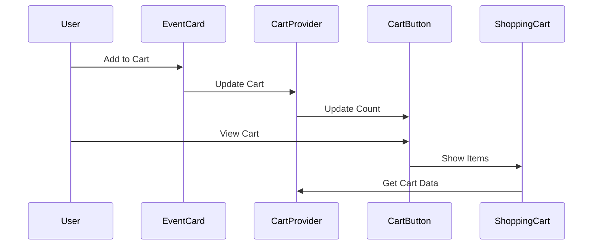
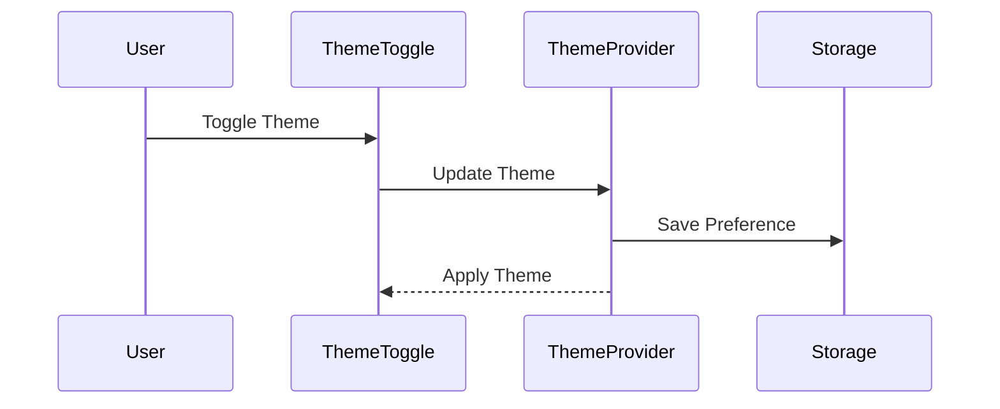
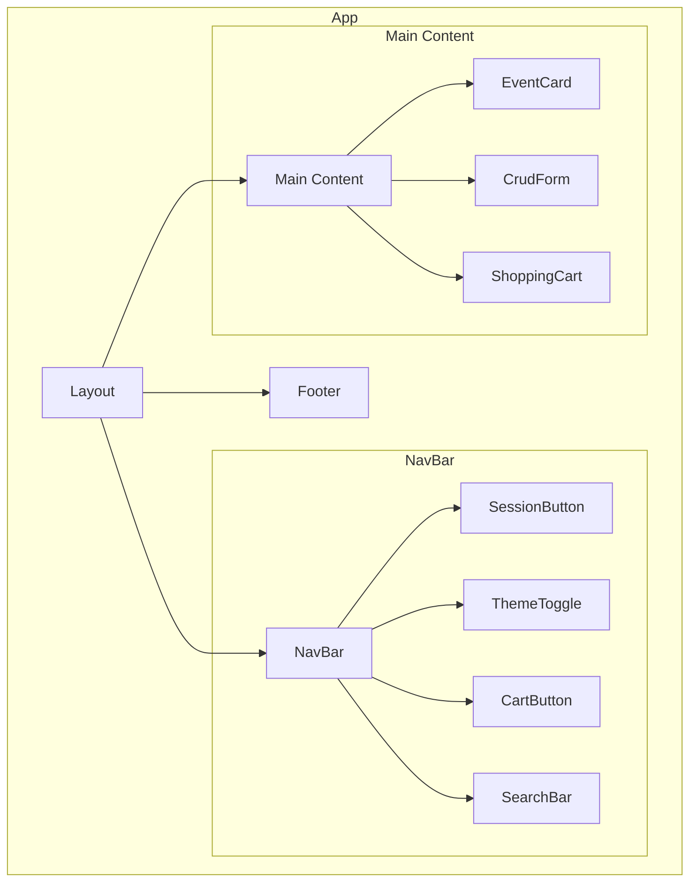
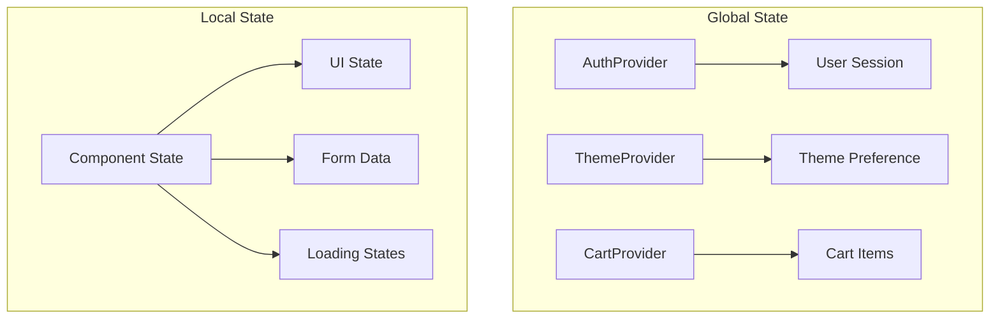
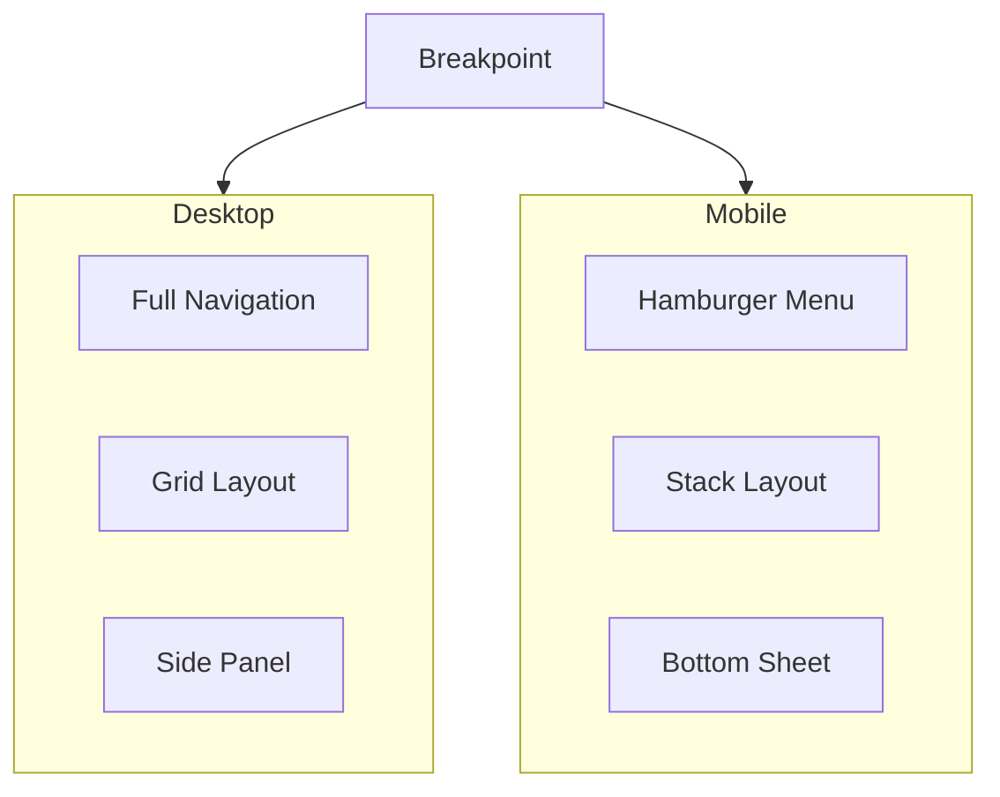
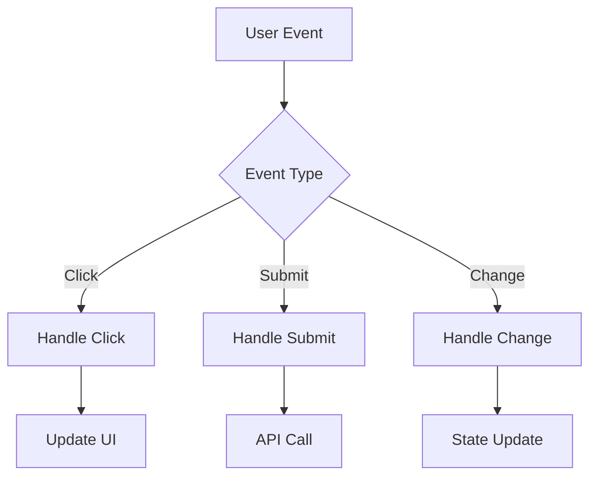

# Component Relationships

## High-Level Architecture

## Component Dependencies

## Data Flow

## Authentication Flow

## Cart Flow

## Theme Switch Flow

## Component Hierarchy

## State Management

## Responsive Behavior

## Event Handling

## Notes

1. **Component Communication**
   - Props down, events up
   - Context for global state
   - Custom hooks for shared logic

2. **State Management**
   - AuthProvider: User session, permissions
   - ThemeProvider: Theme preferences
   - CartProvider: Shopping cart state
   - Local state: Component-specific UI state

3. **Event Flow**
   - User interactions trigger component events
   - Events propagate up through props
   - Context providers manage global state updates
   - UI updates reflect state changes

4. **Responsive Design**
   - Components adapt to screen size
   - Mobile-first approach
   - Breakpoint-based layout changes
   - Conditional rendering for optimal UX